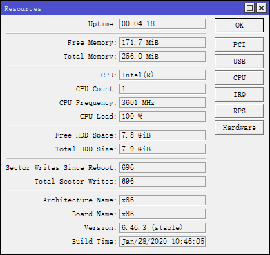

### CVE-2020-20230

#### Description

The `sshd` process suffers from an uncontrolled resource consumption vulnerability. By sending a crafted packet, an authenticated remote user can cause a high cpu load, which may make the device respond slowly or unable to respond.

When testing the proof of concept on an x86 RouterOS VM, this vulnerability will consume all the memory, thus causing the whole system to reboot finally.

Against stable `6.46.3`, the poc resulted in the high cpu load on the device.

#### Affected Version

This vulnerability was initially found in stable  `6.46.3`, and was fixed in stable `6.47`.

#### Timeline

+ 2020/04/08 - reported the vulnerability to the vendor
+ 2020/04/09 - vendor reproduced and confirmed the vulnerability
+ 2020/04/23 - vendor responded that "it has been fixed and will be added to the next public Beta release"
+ 2021/05/04 - CVE was assigned
